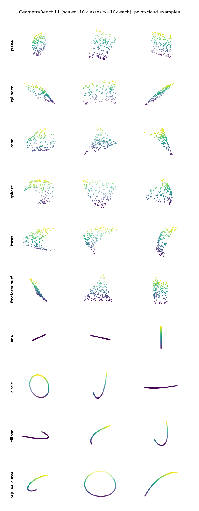
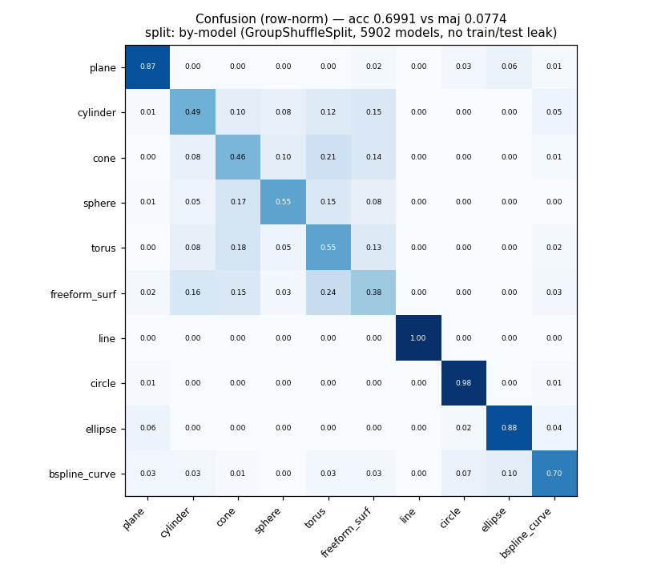

# GeometryBench · L1 扩展：每类万级 + 曲线识别

> 这是对沈老师指示 **"扩展测试集规模至每类曲线/曲面在万级以上"** 的落地实现。
> 在 [L1 曲面识别](README.md)（6 类曲面、34k 题）基础上：**加入曲线识别**、**每类扩到 ≥10k**，
> 数据构造与评测的数据准备均为纯 CPU、无需 GPU。

`118,913 题` · `10 类（6 曲面 + 4 曲线）` · `每类 ≥10k` · `标签由 CAD kernel 自动读出` · `按模型防泄漏划分`



> <sub>曲线是 1D 结构（直线/圆弧/椭圆弧/B 样条），曲面是 2D 点片。分类器要从**点云的形状**判断它采样自哪种几何基元。</sub>

---

## 1. 做了什么

原 L1 只有 6 类**曲面**识别。本次扩展两件事：

1. **加入曲线识别**：从每条边（edge）上沿参数采样 128 个点，由 kernel 读出曲线类型 —— `line / circle / ellipse / bspline_curve`（4 类）。
2. **每类扩到万级**：把 6 类曲面 + 4 类曲线，每类样本数补到 ≥10,000。

合并成**一个统一的 10 类点云识别任务**：给一片点云（128×3），判断它采样自下面哪种基元：

```
曲面: plane  cylinder  cone  sphere  torus  freeform_surf
曲线: line   circle    ellipse  bspline_curve
```

标签仍然**全部由 CAD kernel 直接读出**（`BRepAdaptor_Surface.GetType()` / `BRepAdaptor_Curve.GetType()`），零人工标注。

---

## 2. 数据集（本仓库随附统计 [`l1_scaled/_DATASET_SUMMARY.json`](l1_scaled/_DATASET_SUMMARY.json)）

| 类别 | 数量 | 来源 | | 类别 | 数量 | 来源 |
|---|---|---|---|---|---|---|
| plane | 12,000 | 真实 ABC | | line | 12,000 | ABC + 合成 |
| cylinder | 12,000 | 真实 ABC | | circle | 12,000 | ABC + 合成 |
| cone | 12,000 | 合成 | | ellipse | 12,000 | 合成 |
| sphere | 10,913 | 合成 | | bspline_curve | 12,000 | ABC + 合成 |
| torus | 12,000 | 合成 | | | | |
| freeform_surf | 12,000 | ABC + 合成放样 | | | | |

**合计 118,913 题，来自 5,902 个源模型，10 类全部 ≥10k。**（cap 设为 12k；sphere 10,913 是合成产出的自然上限，已超万级。）

### 稀有类怎么补到万级？—— 合成 CAD 自动出题

真实 ABC 里 `plane/cylinder` 极多，但 `sphere/cone/torus` 稀少（原 L1 里 sphere 仅 547）。直接堆更多 ABC 模型，要么需下载海量数据、要么受内存约束（复杂模型开销大）。所以对稀有类用**程序化合成 CAD**：

- **稀有解析曲面**（sphere/cone/torus）：`gen_synthetic.py` —— 一个基础块上随机布尔（fuse/cut）若干随机图元，产生大量带（常被裁剪的）球/锥/环面片，kernel 免费打标签。
- **自由曲面**（freeform_surf）：`gen_freeform.py` —— `BRepOffsetAPI_ThruSections` 放样（ruled=False）穿过若干变尺度多边形截面，侧面就是 B 样条曲面（每件 ~11 个）。把 freeform 从 3,274 补到 12,000。
- **解析曲线**（ellipse 等）：上面这些合成件的边天然带 line/circle/ellipse/bspline。

合成件全部小巧（开销可控），且**每个面/边的标签仍由 kernel 读出**——合成只负责"造出含这些基元的合法 B-Rep"，标注权威性不变。

> 诚实说明：cone/sphere/torus/ellipse 这几类以**合成几何**为主（非纯真实 ABC）。这是在公开 ABC 子集与算力约束下达到"每类万级"的工程取舍；plane/cylinder/部分 freeform 与曲线仍含大量真实 ABC 样本。若有更大算力/完整 ABC，可平滑替换为纯真实数据。

### 2.1 诚实性体检：合成样本会被"看穿"吗？（[`l1_scaled/_SEP_CHECK.json`](l1_scaled/_SEP_CHECK.json)）

用合成件补量，最该担心的是：**模型会不会不学几何、而是靠"这片云是不是合成的"来作弊？** 我直接量化了这个风险——对每个**同时有真实+合成来源**的类，训练一个二分类器去区分"真实 vs 合成"（用同一套几何特征）：

| 类别 | real-vs-synth 准确率 | AUC | | 类别 | real-vs-synth 准确率 | AUC |
|---|---|---|---|---|---|---|
| plane | 0.84 | 0.91 | | line | 0.92 | 0.98 |
| cylinder | 0.79 | 0.87 | | circle | 0.92 | 0.97 |
| freeform_surf | 0.77 | 0.85 | | bspline_curve | 0.93 | 0.98 |

**结论（不回避）：存在可检测的合成↔真实分布差**——曲面中等（~0.8），**曲线明显（~0.92）**。原因是合成图元/放样产生的面片和边比真实 ABC 更"完整规则"（真实件常被不规则裁剪、长宽比/参数范围更杂），几何特征能捕捉到这种差异。

**这意味着**：以合成为主的稀有类（cone/sphere/torus/ellipse 等），其指标里有一部分可能来自"识别合成风格"而非纯几何理解 —— 读这些类的数字时应带上这个保留。**关键的下一步**正是缩小这个 gap：用分布匹配的更难合成（随机裁剪/扰动参数范围）、或接入更多真实 CAD。把这个体检本身做进交付，是为了让基准**对自己的弱点有自知之明**，而不是藏起来。

---

## 3. Baseline（几何特征 + RandomForest，**按模型划分**）

和原 L1 一致：每片点云提 PCA 特征（特征值天然区分 1D 曲线 / 2D 曲面 / 3D 体）+ 半径统计，喂 RandomForest。**关键：按源模型划分 train/test（GroupShuffleSplit），同一模型的面/边不会同时落到两边**，杜绝泄漏。

| 指标 | 值 |
|---|---|
| 准确率（by-model，无泄漏） | **0.699** |
| 多数类基线 | 0.077 |
| 提升 | **+0.62** |
| 对照：随机划分（有泄漏） | 0.713 |

> **0.699（by-model）才是诚实口径**——同一模型的面/边不会同时落到 train/test。随机划分 0.713 高 1.4 个点，这点差就是泄漏虚高。
> 一个有意思的点：若改用不限规模、容易过拟合的 RF，这个泄漏差会放大到 ~7 个点 ——**泄漏对越能过拟合的模型危害越大**。所以 baseline 特意用规模受限的森林（100 棵 / 深度≤16 / 每棵抽 40% 样本），在控制内存占用的同时也更抗泄漏。



混淆矩阵讲清了任务结构（[`l1_scaled/_BASELINE.json`](l1_scaled/_BASELINE.json)）：

- **曲线块（右下）近乎完美**：line 1.00 / circle 0.98 / ellipse 0.87 / bspline 0.72，且**几乎从不与曲面混淆** —— 1D 与 2D 结构靠简单特征就能分开。
- **曲面块（左上）才是真难点**：cylinder 0.50 / cone 0.45 / sphere 0.54 / torus 0.48 / freeform 0.39，解析曲面互相混淆严重（plane 例外，0.90）。

**这正是基准的价值**：弱 baseline 已能解决"易"的部分（曲线、平面），把**解析曲面判别**这个真问题清晰地暴露出来，留足空间给真正的点云理解模型。

### 鲁棒性：扫描式噪声变体（[`l1_scaled/hard/`](l1_scaled/hard/)）

模拟真实逆向工程里的扫描点云：对每片云做**随机视角自遮挡**（沿随机方向丢掉 30% 远端点再重采样）+ **高斯噪声**（σ=0.03）+ 重归一化；标签与划分都不变，只让输入更难。

| | clean | hard |
|---|---|---|
| 准确率（by-model） | 0.699 | **0.400** |

噪声+遮挡把准确率**几乎砍半（−0.30）**。分项（见 hard 混淆图）很说明问题：

- **直线最抗造**（line 0.91）——加噪后仍是干净的 1D 直线特征；
- **弯曲基元脆弱**：circle 0.51 / ellipse 0.23 / bspline 0.21 —— 部分弧被遮挡+噪声后退化得像直线，大量误判成 line；
- **曲面普遍退化**，cylinder 甚至塌到 0.12（遮挡抹掉了曲率特征）。

clean 上"易"的部分，在 scanned 条件下并不易 —— 这正是为点云**鲁棒**识别留下的提升空间。

---

## 4. 复现

全部脚本在 [`code/`](code/)，按序运行（纯 CPU 实测）：

```bash
# 一次性扩到 10 类 ≥10k（合成稀有曲面 + 提取曲线 + 复用真实 ABC + 组装 + baseline）
bash code/run_l4.sh 5000        # 生成5000合成件 → 提面/提线 → 组装 → baseline，约 3h
# round 2：补自由曲面到万级 + 改按模型划分
bash code/run_l4b.sh 1500       # 放样1500自由曲面件 → 重新组装(带groups) → by-model baseline，约 35min
python code/viz_l4.py <dataset_dir>   # 出示例图 + 混淆矩阵
# 鲁棒性：扫描式噪声/遮挡变体 + 同配置重跑 clean/hard baseline
bash code/run_l4hard.sh         # make_hard(噪声0.03+遮挡0.3) → by-model baseline → 图
bash code/run_rebaseline.sh     # 用同一规模受限 RF 重跑 clean+hard，保证可比
```

关键脚本：`gen_synthetic.py`（稀有解析曲面）、`gen_freeform.py`（放样自由曲面）、`extract_curves.py`（曲线提取，extract_batch 的边版本）、`assemble_l4.py`（组装 10 类 + 写 groups.npy）、`baseline_l4.py`（按模型划分 baseline）。

## 5. 一句话

把 L1 从 6 类曲面扩成 **10 类（曲面 + 曲线）、每类 ≥10k、按模型防泄漏**的识别基准；用**合成 CAD 自动出题**解决稀有类，标签全程由 kernel 读出；按模型划分的 baseline 0.699，把"解析曲面判别"这个真难点留给了下游模型。
