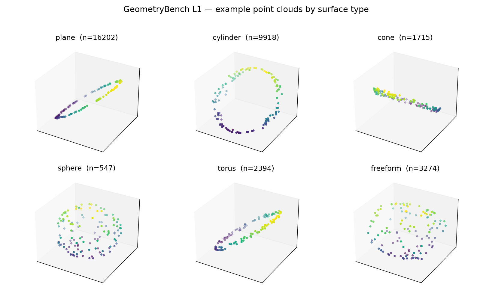
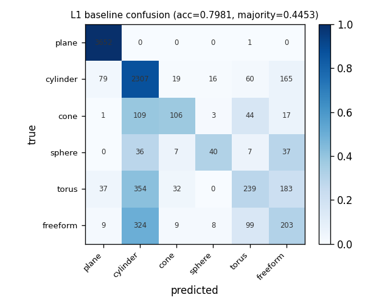
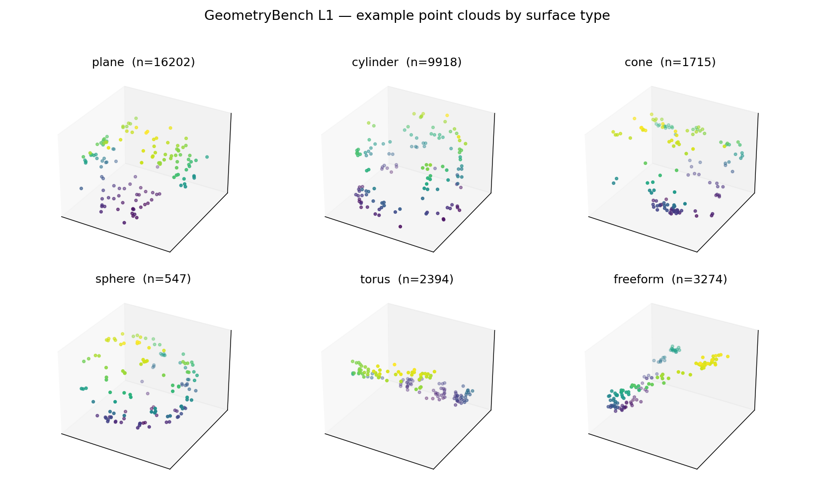

# GeometryBench · L1：曲面识别数据集

**从真实 CAD 模型，让几何引擎自动出题——一个"点云 → 曲面类型"的识别 benchmark。**

`34,050 题` · `6 类曲面` · `标签由 CAD kernel 自动生成` · `按模型防泄漏划分` · `clean + 扫描噪声变体` · `全程跑在 2GB 无卡机上`



> <sub>每类一片示例点云：平面是平的、圆柱成弧、球面散成团——分类器要从这些**形状**判断曲面类型。</sub>

> 这是 **GeometryBench 五级几何智能评测体系**（识别→拓扑→推理→生成→工程发现）中 **L1 识别** 一级的落地实现。设计文档见 [`proposal_draft.md`](proposal_draft.md)；本仓库交付**可复现管线 + 一版数据集 + baseline + 噪声变体**，全程在一台 **2 GB / 0.5 CPU** 的无卡机上跑通。

---

## 1. 这是什么

**任务（L1-T1.1 曲面基元识别）**：给一片从某个 CAD 曲面上采样的点云（128×3），判断它属于哪种曲面：

`plane / cylinder / cone / sphere / torus / freeform`（6 类，freeform = B-spline/Bézier/旋转/拉伸/偏移等自由曲面的统称）。

**核心思想 —— Kernel-as-Oracle**：STEP/B-Rep 文件显式存储了每个面"是什么"（这个面是半径 12.7 的圆柱面）。所以**标签由 CAD kernel 直接读出，零人工标注**。整个数据集因此可程序化生成、可复现、可按需扩量。

本质上它就是一个**点云分类数据集**（类比 ModelNet），但粒度是单个 CAD 面、标签来自几何引擎。

---

## 2. 一版数据集（本仓库随附统计）

| 项 | 值 |
|---|---|
| 任务总数 | **34,050** |
| 每片点数 | 128（已去中心 + 缩放到单位球，强制按形状判别） |
| 张量 | `points.npy (34050,128,3)` · `labels.npy` · `split.npy` |
| 源模型 | ABC 600 个中 **490 成功**（59 个 >3MB、51 个 >500 面/读失败按设计跳过） |
| 难度分层 | complex 32,133 · simple 1,917（complex 件均 167 面，simple 均 6.4 面） |
| **划分（防泄漏）** | **train 25,847 / test 8,203，按 `model_id` 分组** |

类别分布（天然不均衡，机械件里平面/圆柱占多数，球面稀有）：

| plane | cylinder | freeform | torus | cone | sphere |
|---|---|---|---|---|---|
| 16,202 | 9,918 | 3,274 | 2,394 | 1,715 | 547 |

一条样例（`tasks.jsonl`）：

```json
{"task_id":"L1-T1.1-000000","level":1,"task":"surface_recognition",
 "question":"Classify the surface type of the CAD face this point cloud was sampled from.",
 "options":["plane","cylinder","cone","sphere","torus","freeform"],
 "answer":1,"answer_label":"cylinder","split":"train",
 "model_id":"00001535_..._step_002","face_id":3,
 "difficulty":"simple","surface_type":"cylinder","params":{"radius":12.7}}
```

---

## 3. Baseline：可学，但不平凡

一个轻量基线（**几何特征 + RandomForest**，无深度网络——0.5 CPU 上深度网络太慢）：每片点云抽 7 个几何特征（PCA 三特征值、平面拟合残差、径向分布），在**按模型划分**的测试集上评测。

| | 准确率 |
|---|---|
| RandomForest | **0.798** |
| 多数类基线（全猜 plane） | 0.445 |
| **提升** | **+0.353** |

per-class f1：`plane 0.98 · cylinder 0.80 · cone 0.47 · sphere 0.41 · torus 0.37 · freeform 0.32`（macro 0.56）



**怎么读**：简单特征就能把"地基类"（平面/圆柱）几乎打满，但**环面/球/freeform 还差得远**，且难类普遍被误判为 cylinder（主导曲面）。这正是一个有价值的 benchmark 应有的样子——**L1 可学、但留有空间给更强的模型**。在分级体系里，L1 是感知地基，真正拉开差距的是 L2 拓扑、L3 推理。

### 3.5 Hard 变体：模拟扫描点云

真实逆向工程从**带噪、残缺的扫描点云**出发，而非 kernel 的干净采样。`make_hard.py` 在不重新提取的前提下，给每片点云加 **高斯噪声（σ=0.03）+ 方向性遮挡（30%）+ 重归一化**，得到同标签、同划分、但更难的 hard 数据集：

| 数据 | 准确率 | 提升 | macro-f1 |
|---|---|---|---|
| Clean（kernel 干净点） | 0.798 | +0.353 | 0.56 |
| **Hard（噪声+遮挡）** | **0.603** | +0.157 | **0.33** |

准确率掉 ~20 个点，简单几何特征在扫描条件下明显失效（平面 f1 0.98→0.79，球面 0.41→0.08）。这给了 benchmark 一个**难度旋钮**（噪声/遮挡强度），对齐 SHREC 2022 的噪声评测，也直接对接逆向工程场景。



---

## 4. 复现（约 30 分钟）

```bash
# 0. 环境（pythonocc-core 只在 conda-forge 上）
conda create -n brep -c conda-forge python=3.10 pythonocc-core numpy -y
pip install scikit-learn matplotlib            # baseline + 出图

# 1. 下载 ABC 子集（hf-mirror，国内直连，无需代理）
python code/fetch_abc.py 300 300 data/abc_data

# 2. 提取：kernel 读标签 + 面上采点（128/面，跳过 >500 面 / >3MB 的件）
python code/extract_batch.py data/abc_data data/extract_out

# 3. 组装成识别考题（归一化 + 按模型划分 train/test）
python code/assemble_l1.py data/extract_out l1_dataset 128 0

# 4. baseline + 图
python code/baseline_l1.py l1_dataset
python code/viz_l1.py l1_dataset

# 5.（可选）hard 变体：加扫描级噪声+遮挡，重测 → 0.80 掉到 0.60
python code/make_hard.py l1_dataset l1_dataset_hard
python code/baseline_l1.py l1_dataset_hard
```

数据集来源：HuggingFace 镜像 [`turiya-ai/abc-cad-dataset-organized`](https://huggingface.co/datasets/turiya-ai/abc-cad-dataset-organized)（ABC 原始 STEP，按复杂度分 simple/complex）。
> 注：ABC 官方源 `archive.nyu.edu` 当前返回 HTTP 500（[已知故障](https://github.com/deep-geometry/abc-dataset/issues/15)），故走 hf-mirror；模型 ID 与官方一致，恢复后可无缝切回。

---

## 5. 文献定位（这套任务沿用既有定义，贡献不在任务本身）

"从点云识别曲面基元"是被充分研究的问题，本数据集**有意对齐**其标准类别与指标：

- **点云侧**：[Fit4CAD](https://doi.org/10.1016/j.cad.2021.103080) / [SHREC 2022](https://doi.org/10.1016/j.cag.2022.07.004)（plane/cylinder/cone/sphere/torus 五类识别，SHREC 还带噪声评测）、[SPFN](https://arxiv.org/abs/1812.07003)（Primitive Type Accuracy 指标）、[ParSeNet](https://arxiv.org/abs/2003.12181)（加 B-spline，用点+法向）。
- **B-Rep 侧**：[MFCAD++](https://arxiv.org/abs/2006.10211) / [UV-Net](https://arxiv.org/abs/2006.10211) / BRepNet / Hierarchical CADNet（在 B-Rep 图上分类面）。
- 综述：[Geometric Deep Learning for CAD](https://arxiv.org/abs/2402.17695)。

**本工作的差异化**不在 L1 任务新颖，而在：① 它是**统一五级体系**的感知地基；② **Kernel-as-Oracle 在 ABC 规模上自动生成**、可复现、可扩量；③ 多模态可扩展（同一道题也可用 B-Rep 图或文本表示）。

---

## 6. 诚实的局限 与 下一步

- **类别不均衡**：sphere 仅 547（球面本就稀有）；评测请看 per-class，不要只看总准确率。
- **freeform 是杂类**：多种自由曲面合并，是 v1 的简化。
- **近重复**：大量相似平面/圆柱 patch——做识别可接受，但"34K 题"不等于"34K 个迥异样本"。
- **复杂度上限**：>500 面 / >3MB 的大件被跳过（2G 内存所限，对应方案里的难度上限），complex 一档因此偏薄。
- **干净 vs 扫描**：基础数据是 kernel 干净点；已附 `hard` 变体（噪声+遮挡，见 §3.5）模拟扫描，准确率 0.80→0.60，更贴近逆向工程场景。噪声/遮挡强度可调，可做成连续难度曲线。
- **可加 per-point 法向**（ParSeNet 标配，kernel 现成有）让任务更标准——尚未做，需重新提取。

---

## 7. 文件

```
code/
  fetch_abc.py       从 hf-mirror 下载 ABC STEP 子集（stdlib，断点续传）
  extract_batch.py   单进程批量提取（限点/限面、numpy 累积、可续跑）
  extract_l1.py      单模型版（参考实现）
  assemble_l1.py     组装识别考题 + 归一化 + 按模型划分
  baseline_l1.py     几何特征 + RandomForest 基线
  viz_l1.py          出图（示例点云 + 混淆矩阵）
  make_hard.py       hard 变体：加噪声+遮挡模拟扫描（无需重新提取）
  smoke_test.py      工具链冒烟测试（合成带孔方块，无需 ABC）
l1_artifacts/        统计 json + 两张图 + 题目样本（hard/ 为噪声变体的图与基线）
proposal_draft.md    GeometryBench 五级体系设计文档
```
