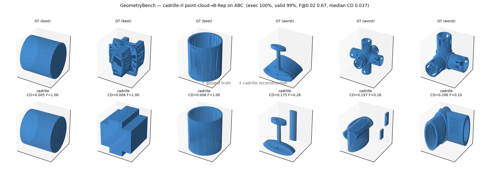

# SOTA Point-Cloud→B-Rep 评测：cadrille 在 ABC 上的重建结果

按沈老师要求"系统评测 SOTA Point Cloud to BRep 方法"，本节在 **GeometryBench 的 ABC 测试集**上评测了 **cadrille**（CAD-Recode 的多模态升级版，ICLR 2026，点云→CadQuery 代码→B-Rep 的 SOTA 之一），权重用其 **RL（SOTA）checkpoint** `maksimko123/cadrille-rl`。

## 协议
- **测试集**：300 个 ABC 模型（STEP → 归一化到单位立方体的 STL；cadrille 采样 8192 点 → FPS 256 点输入）。与 GeometryBench 同源（ABC），不用 cadrille 自带的 DeepCAD split——刻意测"SOTA 方法在我们 benchmark 上的表现"。
- **流程**：点云 → cadrille 生成 CadQuery 代码 → `exec`（子进程+超时）→ OCCT 实体 → STEP/mesh → 指标。
- **指标**：代码可执行率、B-Rep 合法率（kernel 体检）、Chamfer 距离 / F-score@0.02（预测 mesh vs GT mesh，均归一化到单位帧后比较）。
- **硬件/耗时**：单张 RTX 4090；生成 52s、exec 9min、评测 20s。

## 结果（300 模型）

| 指标 | cadrille-rl |
|---|---|
| 代码可执行率 | **100%** (300/300) |
| B-Rep 合法率 | **99%** |
| Mean Chamfer | 0.046 |
| Median Chamfer | 0.037 |
| **F-score@0.02** | **0.673** |

上排 GT，下排 cadrille 重建。左 3 = Chamfer 最小，右 3 = 最大。

## 结论（诚实）
- **cadrille 极可靠地产出合法 CAD**：100% 可执行、99% 合法实体。这是它最强的一面——即使形状不准，输出也是有效、可编辑的 CAD。
- **但几何保真度中等**：F-score 0.67、Chamfer ~3.7%。简单解析形状（圆柱、方块、空心筒）几乎完美还原；**复杂多分支零件（管接头、弯头、T 形件）只能给出简化或残缺的近似**（见图右 3 例）。
- **根因是分布偏移**：cadrille 在 DeepCAD（较简单的 sketch-extrude）上训练，而 ABC 更杂、更复杂。这恰恰是 GeometryBench 这类 benchmark 的价值——**暴露 SOTA 方法在多样真实几何上的能力边界**，而不是在它训练分布内的乐观数字。

## 在 GeometryBench 中的位置
这是一个**重建评测**（点云→整模型 B-Rep），比 L1 识别高一档（更接近方案里的 L4 生成 / Phase 1 调研那条线）。与 L1 共用同一 ABC 数据底座、同一 kernel-as-oracle 取标签/判合法的范式，体现了"一套数据底座贯穿多级评测"的设计。

## 复现
脚本见 `cadrille_eval/`：`prep_testset.py`（STEP→归一化 STL）、`run_full.sh`（生成→exec→评测）、`exec_to_brep.py`、`eval_recon.py`、`viz_recon.py`。环境 `cadrille_setup.sh`（torch2.5/cu124 + cadquery-ocp + cadrille-rl 权重；AutoDL 上需 `source /etc/network_turbo` 加速）。
